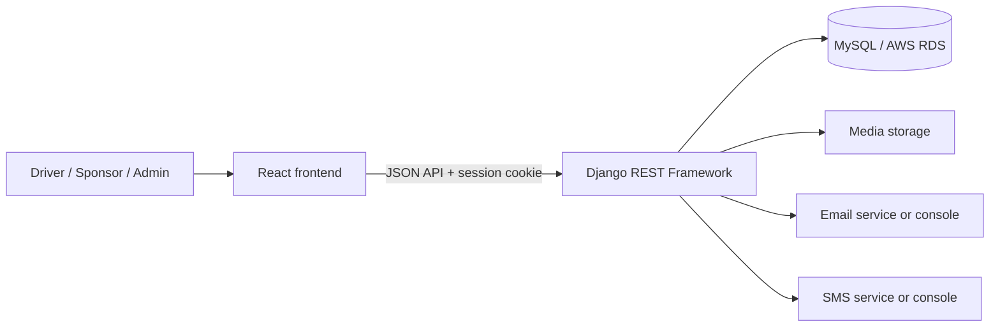

# Good Driver Incentive Program

The Good Driver Incentive Program is a full-stack web application for rewarding safe driving. Drivers maintain profiles and participate in sponsor programs, sponsors manage enrolled drivers, and administrators manage accounts and program information.

This repository is maintained by **CPSC 4910 Team 11**.

> [!IMPORTANT]
> Never commit database passwords, Django secret keys, MFA encryption keys, provider credentials, or populated `.env` files. Use the checked-in `.env.example` files as templates and share real values through an approved private channel.

## Contents

- [Current capabilities](#current-capabilities)
- [Architecture](#architecture)
- [Repository structure](#repository-structure)
- [Prerequisites](#prerequisites)
- [Local setup on Windows](#local-setup-on-windows)
- [Local setup on macOS or Linux](#local-setup-on-macos-or-linux)
- [Launching the application](#launching-the-application)
- [Testing and building](#testing-and-building)
- [Database and migrations](#database-and-migrations)
- [Environment variables](#environment-variables)
- [Git and release workflow](#git-and-release-workflow)
- [Documentation](#documentation)
- [Security notes](#security-notes)
- [Troubleshooting](#troubleshooting)

## Current capabilities

### Authentication and account security

- Driver and sponsor registration
- Shared login flow with role-aware sessions
- Session authentication with CSRF protection
- Password changes and password validation
- Authenticator-app, email, and SMS MFA support
- Sponsor MFA enrollment requirements
- MFA recovery/reset foundations

### Profiles

- Authenticated self-profile viewing and editing
- Driver profile-picture upload and removal
- Driver sponsor-organization visibility
- Case-insensitive username uniqueness
- Consistent username normalization and validation
- Self-scoped profile authorization

### Administration

- Admin user directory with search and role filters
- Driver, sponsor, and administrator account creation
- Driver and sponsor account detail/edit pages
- Sponsor assignment and reassignment
- Account activation and deactivation
- Role-aware access controls and validation

### Program information and driver management

- Database-backed About page with product, team, sprint/version, and release information
- Seed command for initial About-page content
- Sponsor-scoped driver list
- Driver-to-sponsor linking
- Driver detail viewing and approval workflow foundations

## Architecture



| Layer | Technology | Default local address |
| --- | --- | --- |
| Frontend | React 19, React Router, React Scripts | `http://localhost:3000` |
| Backend | Django 6.1, Django REST Framework | `http://localhost:8000` |
| API | Session-authenticated JSON endpoints | `http://localhost:8000/api/` |
| Database | MySQL in shared environments; SQLite locally/tests | Configured in `backend/.env` |
| MFA | PyOTP, encrypted TOTP seeds, email/SMS delivery | Configured in `backend/.env` |

## Repository structure

```text
F26-CPSC4910-Team11/
├── backend/
│   ├── about_page/       # Release/About content
│   ├── accounts/         # Authentication, profiles, MFA, admin accounts
│   ├── config/           # Django project configuration
│   ├── drivers/          # Driver data and sponsor-facing driver API
│   ├── sql/              # Development/admin SQL helpers
│   ├── .env.example
│   ├── manage.py
│   └── requirements.txt
├── frontend/
│   ├── public/
│   ├── src/
│   │   ├── auth/
│   │   ├── components/
│   │   └── config/
│   ├── .env.example
│   └── package.json
├── docs/
│   └── PROJECT_TODO.md
└── README.md
```

## Prerequisites

- Git
- Python compatible with the pinned Django version
- Node.js and npm
- MySQL client development dependencies when using MySQL
- Team 11 database credentials when using shared AWS RDS

SQLite can be used for isolated local development and automated tests. Shared integration work should be verified against MySQL before release.

## Local setup on Windows

Run these commands from PowerShell.

### 1. Clone and enter the repository

```powershell
git clone <repository-url>
Set-Location "F26-CPSC4910-Team11"
```

### 2. Create the backend virtual environment

```powershell
Set-Location backend
py -m venv venv
.\venv\Scripts\Activate.ps1
python -m pip install --upgrade pip
pip install -r requirements.txt
```

If PowerShell blocks virtual-environment activation:

```powershell
Set-ExecutionPolicy -Scope Process -ExecutionPolicy Bypass
.\venv\Scripts\Activate.ps1
```

### 3. Create the backend environment file

```powershell
Copy-Item .env.example .env
```

For isolated local development, set this in `backend/.env`:

```dotenv
DB_ENGINE=sqlite
```

For shared integration testing, use `DB_ENGINE=mysql` and privately obtain the Team 11 application-database credentials. Do not use or commit the shared server administrator password.

Generate a Fernet key for local MFA encryption:

```powershell
python -c "from cryptography.fernet import Fernet; print(Fernet.generate_key().decode())"
```

Copy the output into `TOTP_ENCRYPTION_KEY` in `backend/.env`.

> [!NOTE]
> Django loads `backend/.env` through the project settings. PowerShell does not use the Unix command `export $(grep ...)`.

### 4. Apply migrations

```powershell
python manage.py migrate
python manage.py check --database default
```

Optionally seed the About page:

```powershell
python manage.py seed_about_page
```

### 5. Install the frontend

Open another PowerShell terminal:

```powershell
Set-Location "<repository-path>\frontend"
Copy-Item .env.example .env
npm install
```

Use `npm ci` instead of `npm install` in CI or when reproducing the exact lockfile environment.

## Local setup on macOS or Linux

```bash
cd backend
python3 -m venv venv
source venv/bin/activate
python -m pip install --upgrade pip
pip install -r requirements.txt
cp .env.example .env
python manage.py migrate
python manage.py check --database default
```

In another terminal:

```bash
cd frontend
cp .env.example .env
npm install
```

Update both `.env` files with the appropriate local or privately supplied shared-environment values.

## Launching the application

### Backend

From `backend/` with the virtual environment active:

```powershell
python manage.py runserver
```

The API is available at `http://localhost:8000/api/`.

### Frontend

From `frontend/` in a separate terminal:

```powershell
npm start
```

The React development server normally opens `http://localhost:3000`.

If port 3000 is occupied, React may offer another port such as 3001. Django currently trusts the configured development origins, so either stop the old frontend process or add the alternate origin to the local CORS/CSRF configuration before testing authenticated writes.

## Testing and building

### Backend

From `backend/`:

```powershell
$env:DB_ENGINE = "sqlite"
python manage.py test
python manage.py makemigrations --check --dry-run
python manage.py check
```

### Frontend

From `frontend/`:

```powershell
$env:CI = "true"
npm test -- --watchAll=false --runInBand
npm run build
```

Generated build output is not source code and should not be committed.

## Database and migrations

| `DB_ENGINE` | Use case |
| --- | --- |
| `sqlite` | Isolated local development and tests |
| `mysql` | Shared Team 11 integration database and deployment |

After pulling model or migration changes:

```powershell
Set-Location backend
.\venv\Scripts\Activate.ps1
python manage.py migrate
```

Before creating a migration, review the working tree and coordinate with teammates to avoid conflicting migration numbers.

```powershell
python manage.py makemigrations
python manage.py migrate
python manage.py test
```

> [!CAUTION]
> Do not manually create Django-managed tables in production unless the team explicitly designed that operation. Schema changes should normally be represented by reviewed Django migrations.

The files under `backend/sql/` are administrative/development helpers. Review placeholders and the target schema carefully before executing them, and never add real credentials to these files.

## Environment variables

### Backend

Use [`backend/.env.example`](backend/.env.example) as the source of truth.

| Variable | Required | Purpose |
| --- | --- | --- |
| `DB_ENGINE` | Yes | `sqlite` or `mysql` |
| `DB_NAME` | For MySQL | Team application schema |
| `DB_USER` | For MySQL | Restricted application database user |
| `DB_PASSWORD` | For MySQL | Application database password |
| `DB_HOST` | For MySQL | MySQL/RDS hostname |
| `DB_PORT` | For MySQL | MySQL port; normally `3306` |
| `TOTP_ENCRYPTION_KEY` | Yes | Encrypts stored authenticator-app seeds |
| `EMAIL_*` | Optional locally | Email delivery; console backend is the local default |
| `TWILIO_*` | Optional locally | SMS delivery; blank values use the console/log fallback |

The TOTP encryption key must remain stable within an environment. Changing it without migrating existing data can make stored MFA seeds unreadable.

### Frontend

Use [`frontend/.env.example`](frontend/.env.example):

```dotenv
REACT_APP_API_URL=http://localhost:8000/api
```

React variables are embedded at build time. Never place secrets in frontend environment variables.

## Git and release workflow

- Develop on short-lived `feature/`, `fix/`, `docs/`, or `refactor/` branches.
- Open a pull request before merging into `main`.
- Include the sprint in commits that will reach `main`:

  ```text
  [Sprint 3] feat: add sponsor organization management
  ```

- Create professor-required annotated sprint tags from accepted `main` commits:

  ```powershell
  git switch main
  git pull --ff-only origin main
  git tag -a sprint-03 -m "Sprint 3 accepted release"
  git push origin sprint-03
  ```

- Create semantic version tags such as `v0.3.0` for deployable releases.
- Create GitHub Releases from version tags.
- Never move or reuse a published sprint or release tag.
- Store CI/CD credentials in GitHub repository or environment secrets.
- Use GitHub Actions for tests, releases, and deployment once those workflows are established.

See [`docs/PROJECT_TODO.md`](docs/PROJECT_TODO.md) for the detailed engineering, tagging, release, and deployment backlog.

## Documentation

- [Engineering backlog and project TODO](docs/PROJECT_TODO.md)
- [Backend environment template](backend/.env.example)
- [Frontend environment template](frontend/.env.example)
- API and data documentation are planned under `docs/`.
- Lucidchart is the collaborative source for DFDs, ERDs, and context diagrams; exported versions should be committed under `docs/diagrams/`.

## Security notes

- Never commit `.env` files or credentials.
- Never expose the RDS administrator password to the application.
- Do not use production data in screenshots, fixtures, or tests.
- Enforce permissions and validation in Django; frontend checks are usability features, not security boundaries.
- Keep secrets out of React builds because browser-delivered code is public.
- Rotate any credential that was committed or exposed.
- Run `python manage.py check --deploy` before production deployment.

## Troubleshooting

<details>
<summary><strong>PowerShell cannot activate the virtual environment</strong></summary>

```powershell
Set-ExecutionPolicy -Scope Process -ExecutionPolicy Bypass
.\venv\Scripts\Activate.ps1
```

</details>

<details>
<summary><strong>Django reports missing database variables</strong></summary>

Confirm that `backend/.env` exists and that `DB_ENGINE` matches the variables supplied. MySQL requires `DB_NAME`, `DB_USER`, `DB_PASSWORD`, and `DB_HOST`; SQLite does not.

</details>

<details>
<summary><strong>Django reports a missing TOTP encryption key</strong></summary>

Generate a Fernet key and add it to `backend/.env`:

```powershell
python -c "from cryptography.fernet import Fernet; print(Fernet.generate_key().decode())"
```

</details>

<details>
<summary><strong>MySQL Workbench warns about MySQL 8.4</strong></summary>

Workbench may warn when the server is newer than the versions it officially targets. This does not necessarily mean the connection failed. Continue only when the hostname and credentials came from the approved team source, then confirm the expected Team 11 schema is present.

</details>

<details>
<summary><strong>The frontend starts on port 3001</strong></summary>

Another process is using port 3000. Stop that process and restart React, or update the local backend CORS and CSRF trusted origins before making authenticated requests from the alternate port.

</details>

---

_Last updated: 2026-09-23_
