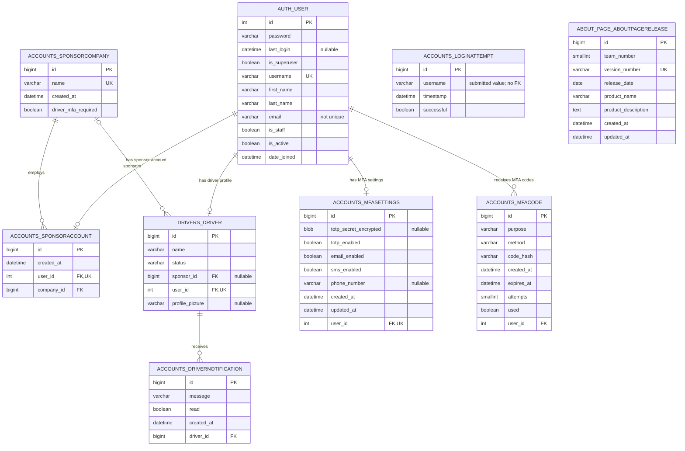
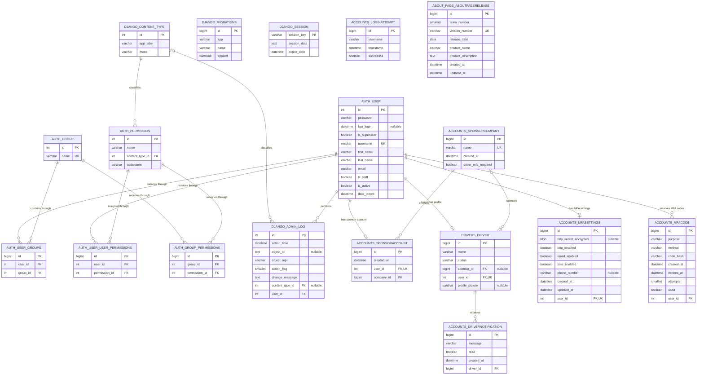

# Good Driver Incentive Program Database ERD

This document reflects the tables, columns, keys, and relationships currently deployed in `Team11_DB`. It is based on the MySQL Workbench schema exports and the corresponding Django models and migrations.

## Application data model

This view emphasizes the tables used directly by application features. Django's `auth_user` table is included because application profiles and security records reference it.

`accounts_loginattempt` deliberately stores a submitted username rather than a foreign key so failed attempts for nonexistent usernames can be recorded. `about_page_aboutpagerelease` is currently independent of the other application tables.

## Complete physical database

This view adds Django's authorization, administration, migration, content-type, and session infrastructure. It represents all 18 tables currently present in the database.

## Composite unique constraints and indexes

Mermaid ER diagrams cannot fully express every composite index, so these constraints supplement the diagrams:

| Table | Columns | Constraint or index |
| --- | --- | --- |
| `accounts_mfacode` | `user_id`, `purpose`, `used` | Non-unique composite index |
| `auth_group_permissions` | `group_id`, `permission_id` | Composite unique constraint |
| `auth_permission` | `content_type_id`, `codename` | Composite unique constraint |
| `auth_user_groups` | `user_id`, `group_id` | Composite unique constraint |
| `auth_user_user_permissions` | `user_id`, `permission_id` | Composite unique constraint |
| `django_content_type` | `app_label`, `model` | Composite unique constraint |
| `django_session` | `expire_date` | Non-unique index |

Foreign-key indexes and single-column unique indexes are shown by `FK` and `UK` markers in the diagrams.

## Scope

The following proposed entities from the earlier WIP diagram are not currently deployed and are intentionally excluded from the current-state ERD:

- Admin user profile
- Driver application
- Purchase order
- Order item
- Catalog item
- Point transaction
- Audit user

They should be maintained separately in a future-state or planned-schema diagram until corresponding Django models and migrations are implemented.
