# Good Driver Incentive Program Database ERD

This document reflects the tables, columns, keys, and relationships defined by
the repository's current Django models and migrations. It began with MySQL
Workbench exports from `Team11_DB` and has been updated for subsequent migrations;
run `python manage.py migrate` to bring an environment to this schema.

## Application data model

This view emphasizes the tables used directly by application features. Django's `auth_user` table is included because application profiles and security records reference it.

```mermaid
erDiagram
    AUTH_USER {
        int id PK
        varchar password
        datetime last_login "nullable"
        boolean is_superuser
        varchar username UK
        varchar first_name
        varchar last_name
        varchar email "not unique"
        boolean is_staff
        boolean is_active
        datetime date_joined
    }

    ACCOUNTS_SPONSORCOMPANY {
        bigint id PK
        varchar name UK
        datetime created_at
        boolean driver_mfa_required
    }

    ACCOUNTS_SPONSORACCOUNT {
        bigint id PK
        datetime created_at
        int user_id FK, UK
        bigint company_id FK
    }

    DRIVERS_DRIVER {
        bigint id PK
        varchar name
        varchar status
        bigint sponsor_id FK "nullable"
        int user_id FK, UK
        varchar profile_picture "nullable"
    }

    ACCOUNTS_MFASETTINGS {
        bigint id PK
        blob totp_secret_encrypted "nullable"
        boolean totp_enabled
        boolean email_enabled
        boolean sms_enabled
        varchar phone_number "nullable"
        datetime created_at
        datetime updated_at
        int user_id FK, UK
    }

    ACCOUNTS_MFACODE {
        bigint id PK
        varchar purpose
        varchar method
        varchar code_hash
        datetime created_at
        datetime expires_at
        smallint attempts
        boolean used
        int user_id FK
    }

    ACCOUNTS_MFABACKUPCODE {
        bigint id PK
        varchar code_hash
        datetime created_at
        datetime used_at "nullable"
        int user_id FK
    }

    ACCOUNTS_DRIVERNOTIFICATION {
        bigint id PK
        varchar message
        boolean read
        datetime created_at
        bigint driver_id FK
    }

    ACCOUNTS_LOGINATTEMPT {
        bigint id PK
        varchar username "submitted value"
        datetime timestamp
        boolean successful
        int user_id FK "nullable"
    }

    ACCOUNTS_REGISTRATIONSETTINGS {
        bigint id PK "single row, id 1"
        boolean email_verification_required
        datetime updated_at
    }

    ACCOUNTS_REGISTRATIONEMAILCODE {
        bigint id PK
        varchar email
        varchar code_hash
        datetime created_at
        datetime expires_at
        smallint attempts
        boolean used
    }

    ACCOUNTS_TRUSTEDDEVICE {
        bigint id PK
        varchar token_hash "SHA-256 of the browser token"
        datetime created_at
        datetime last_used_at
        int user_id FK
    }

    ACCOUNTS_ADMINIMPERSONATIONEVENT {
        bigint id PK
        varchar target_role
        varchar action
        varchar ip_address "nullable"
        datetime created_at
        int admin_id FK "nullable"
        int target_id FK "nullable"
    }

    ABOUT_PAGE_ABOUTPAGERELEASE {
        bigint id PK
        smallint team_number
        varchar version_number UK
        date release_date
        varchar product_name
        text product_description
        datetime created_at
        datetime updated_at
    }

    AUTH_USER ||--o| DRIVERS_DRIVER : "has driver profile"
    AUTH_USER ||--o| ACCOUNTS_SPONSORACCOUNT : "has sponsor account"
    AUTH_USER ||--o| ACCOUNTS_MFASETTINGS : "has MFA settings"
    AUTH_USER ||--o{ ACCOUNTS_MFACODE : "receives MFA codes"
    AUTH_USER ||--o{ ACCOUNTS_MFABACKUPCODE : "has backup codes"
    AUTH_USER o|--o{ ACCOUNTS_LOGINATTEMPT : "has sign-in attempts"
    AUTH_USER ||--o{ ACCOUNTS_TRUSTEDDEVICE : "trusts browsers"
    AUTH_USER o|--o{ ACCOUNTS_ADMINIMPERSONATIONEVENT : "starts view-as events"
    AUTH_USER o|--o{ ACCOUNTS_ADMINIMPERSONATIONEVENT : "is view-as target"
    ACCOUNTS_SPONSORCOMPANY ||--o{ ACCOUNTS_SPONSORACCOUNT : "employs"
    ACCOUNTS_SPONSORCOMPANY o|--o{ DRIVERS_DRIVER : "sponsors"
    DRIVERS_DRIVER ||--o{ ACCOUNTS_DRIVERNOTIFICATION : "receives"
```

`accounts_loginattempt` stores the submitted username and a nullable `user_id`, so failed attempts for nonexistent usernames can still be recorded while history follows an account through username changes. `accounts_mfabackupcode` rows are one-time-use: `used_at` is set the moment a code is consumed and the full set is replaced (old rows deleted) whenever backup codes are regenerated or every MFA method is disabled. `accounts_adminimpersonationevent` is an append-only view-as audit record; its administrator and target references become null rather than deleting the event when an account is removed. `accounts_registrationsettings` holds a single row of site-wide account creation options. `accounts_registrationemailcode` stores hashed signup verification codes keyed by email address rather than by user, because the account does not exist until the code is accepted. `accounts_trusteddevice` records each browser a user marked as theirs when asked "Is this your device?". It stores only a hash of the random token held in the browser's HttpOnly cookie, and no IP address, user agent, or location (see [Session Security](SESSION_SECURITY.md)). `about_page_aboutpagerelease` is currently independent of the other application tables.

## Complete physical database

This view adds Django's authorization, administration, migration, content-type, and session infrastructure. It represents all 23 tables defined by the current Django migrations.

```mermaid
erDiagram
    AUTH_USER {
        int id PK
        varchar password
        datetime last_login "nullable"
        boolean is_superuser
        varchar username UK
        varchar first_name
        varchar last_name
        varchar email
        boolean is_staff
        boolean is_active
        datetime date_joined
    }

    AUTH_GROUP {
        int id PK
        varchar name UK
    }

    AUTH_PERMISSION {
        int id PK
        varchar name
        int content_type_id FK
        varchar codename
    }

    AUTH_USER_GROUPS {
        bigint id PK
        int user_id FK
        int group_id FK
    }

    AUTH_USER_USER_PERMISSIONS {
        bigint id PK
        int user_id FK
        int permission_id FK
    }

    AUTH_GROUP_PERMISSIONS {
        bigint id PK
        int group_id FK
        int permission_id FK
    }

    DJANGO_CONTENT_TYPE {
        int id PK
        varchar app_label
        varchar model
    }

    DJANGO_ADMIN_LOG {
        int id PK
        datetime action_time
        text object_id "nullable"
        varchar object_repr
        smallint action_flag
        text change_message
        int content_type_id FK "nullable"
        int user_id FK
    }

    DJANGO_MIGRATIONS {
        bigint id PK
        varchar app
        varchar name
        datetime applied
    }

    DJANGO_SESSION {
        varchar session_key PK
        text session_data
        datetime expire_date
    }

    ACCOUNTS_SPONSORCOMPANY {
        bigint id PK
        varchar name UK
        datetime created_at
        boolean driver_mfa_required
    }

    ACCOUNTS_SPONSORACCOUNT {
        bigint id PK
        datetime created_at
        int user_id FK, UK
        bigint company_id FK
    }

    DRIVERS_DRIVER {
        bigint id PK
        varchar name
        varchar status
        bigint sponsor_id FK "nullable"
        int user_id FK, UK
        varchar profile_picture "nullable"
    }

    ACCOUNTS_MFASETTINGS {
        bigint id PK
        blob totp_secret_encrypted "nullable"
        boolean totp_enabled
        boolean email_enabled
        boolean sms_enabled
        varchar phone_number "nullable"
        datetime created_at
        datetime updated_at
        int user_id FK, UK
    }

    ACCOUNTS_MFACODE {
        bigint id PK
        varchar purpose
        varchar method
        varchar code_hash
        datetime created_at
        datetime expires_at
        smallint attempts
        boolean used
        int user_id FK
    }

    ACCOUNTS_MFABACKUPCODE {
        bigint id PK
        varchar code_hash
        datetime created_at
        datetime used_at "nullable"
        int user_id FK
    }

    ACCOUNTS_DRIVERNOTIFICATION {
        bigint id PK
        varchar message
        boolean read
        datetime created_at
        bigint driver_id FK
    }

    ACCOUNTS_LOGINATTEMPT {
        bigint id PK
        varchar username "submitted value"
        datetime timestamp
        boolean successful
        int user_id FK "nullable"
    }

    ACCOUNTS_REGISTRATIONSETTINGS {
        bigint id PK "single row, id 1"
        boolean email_verification_required
        datetime updated_at
    }

    ACCOUNTS_REGISTRATIONEMAILCODE {
        bigint id PK
        varchar email
        varchar code_hash
        datetime created_at
        datetime expires_at
        smallint attempts
        boolean used
    }

    ACCOUNTS_TRUSTEDDEVICE {
        bigint id PK
        varchar token_hash "SHA-256 of the browser token"
        datetime created_at
        datetime last_used_at
        int user_id FK
    }

    ACCOUNTS_ADMINIMPERSONATIONEVENT {
        bigint id PK
        varchar target_role
        varchar action
        varchar ip_address "nullable"
        datetime created_at
        int admin_id FK "nullable"
        int target_id FK "nullable"
    }

    ABOUT_PAGE_ABOUTPAGERELEASE {
        bigint id PK
        smallint team_number
        varchar version_number UK
        date release_date
        varchar product_name
        text product_description
        datetime created_at
        datetime updated_at
    }

    AUTH_USER ||--o| DRIVERS_DRIVER : "has driver profile"
    AUTH_USER ||--o| ACCOUNTS_SPONSORACCOUNT : "has sponsor account"
    AUTH_USER ||--o| ACCOUNTS_MFASETTINGS : "has MFA settings"
    AUTH_USER ||--o{ ACCOUNTS_MFACODE : "receives MFA codes"
    AUTH_USER ||--o{ ACCOUNTS_MFABACKUPCODE : "has backup codes"
    AUTH_USER o|--o{ ACCOUNTS_LOGINATTEMPT : "has sign-in attempts"
    AUTH_USER ||--o{ ACCOUNTS_TRUSTEDDEVICE : "trusts browsers"
    AUTH_USER o|--o{ ACCOUNTS_ADMINIMPERSONATIONEVENT : "starts view-as events"
    AUTH_USER o|--o{ ACCOUNTS_ADMINIMPERSONATIONEVENT : "is view-as target"
    ACCOUNTS_SPONSORCOMPANY ||--o{ ACCOUNTS_SPONSORACCOUNT : "employs"
    ACCOUNTS_SPONSORCOMPANY o|--o{ DRIVERS_DRIVER : "sponsors"
    DRIVERS_DRIVER ||--o{ ACCOUNTS_DRIVERNOTIFICATION : "receives"

    AUTH_USER ||--o{ AUTH_USER_GROUPS : "belongs through"
    AUTH_GROUP ||--o{ AUTH_USER_GROUPS : "contains through"
    AUTH_USER ||--o{ AUTH_USER_USER_PERMISSIONS : "receives through"
    AUTH_PERMISSION ||--o{ AUTH_USER_USER_PERMISSIONS : "assigned through"
    AUTH_GROUP ||--o{ AUTH_GROUP_PERMISSIONS : "receives through"
    AUTH_PERMISSION ||--o{ AUTH_GROUP_PERMISSIONS : "assigned through"
    DJANGO_CONTENT_TYPE ||--o{ AUTH_PERMISSION : "classifies"
    DJANGO_CONTENT_TYPE o|--o{ DJANGO_ADMIN_LOG : "classifies"
    AUTH_USER ||--o{ DJANGO_ADMIN_LOG : "performs"
```

## Composite unique constraints and indexes

Mermaid ER diagrams cannot fully express every composite index, so these constraints supplement the diagrams:

| Table                            | Columns                             | Constraint or index         |
| -------------------------------- | ----------------------------------- | --------------------------- |
| `accounts_loginattempt`          | `user_id`, `timestamp` (descending) | Non-unique composite index  |
| `accounts_mfacode`               | `user_id`, `purpose`, `used`        | Non-unique composite index  |
| `accounts_registrationemailcode` | `email`, `used`                     | Non-unique composite index  |
| `accounts_trusteddevice`         | `user_id`, `token_hash`             | Non-unique composite index  |
| `auth_group_permissions`         | `group_id`, `permission_id`         | Composite unique constraint |
| `auth_permission`                | `content_type_id`, `codename`       | Composite unique constraint |
| `auth_user_groups`               | `user_id`, `group_id`               | Composite unique constraint |
| `auth_user_user_permissions`     | `user_id`, `permission_id`          | Composite unique constraint |
| `django_content_type`            | `app_label`, `model`                | Composite unique constraint |
| `django_session`                 | `expire_date`                       | Non-unique index            |

Foreign-key indexes and single-column unique indexes are shown by `FK` and `UK` markers in the diagrams.

## Scope

The following proposed entities from the earlier WIP diagram are not currently deployed and are intentionally excluded from the current-state ERD:

- Admin user profile
- Driver application
- Purchase order
- Order item
- Catalog item
- Point transaction
- Audit user

They should be maintained separately in a future-state or planned-schema diagram until corresponding Django models and migrations are implemented.

---

_Last reviewed against Django models and migrations: 2026-10-06._
