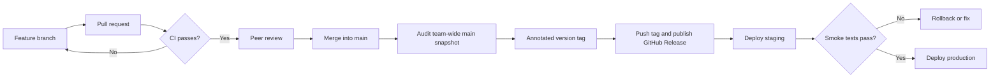

# Git and GitHub Guidelines

How the team names branches, writes commits, merges pull requests, numbers
versions, tags releases, and publishes GitHub Releases.

This is the team's authoritative Git and GitHub process. `PROJECT_TODO.md` is a
planning checklist, not a source of workflow rules. If a stale TODO item
conflicts with this document, follow this document and update the TODO
separately.

These rules apply to every contributor and every change intended for `main`.
Items still awaiting a team or professor decision are marked **Open**.

## Contents

- [Quick reference](#quick-reference)
- [Team responsibilities](#team-responsibilities)
- [Branches](#branches)
- [Commits](#commits)
- [Pull requests](#pull-requests)
- [Merges](#merges)
- [Versions](#versions)
- [Tags](#tags)
- [GitHub Releases](#github-releases)
- [Restoring an earlier release](#restoring-an-earlier-release)
- [End-of-sprint release checklist](#end-of-sprint-release-checklist)
- [Release flow](#release-flow)
- [What never goes into Git](#what-never-goes-into-git)
- [Fixing mistakes](#fixing-mistakes)

## Quick reference

| Thing             | Format                                   | Example                                          |
| ----------------- | ---------------------------------------- | ------------------------------------------------ |
| Branch            | `<type>/<sprintN>-<topic>`               | `feature/sprint4-points-rewards`                 |
| Commit            | `[Label] type(scope): summary`           | `[Sprint 4] feat(points): add point history API` |
| Pull request      | Same as a commit summary                 | `[Sprint 4] feat: add role-based navigation`     |
| Merge commit      | `[Sprint N] merge: summary (#PR)`        | `[Sprint 4] merge: integrate points work (#28)`  |
| Version           | `MAJOR.MINOR.PATCH`, `-dev.N` while open | `0.4.0-dev.84`, then `0.4.0`                     |
| Version tag       | `vMAJOR.MINOR.PATCH`                     | `v0.3.0`                                         |

## Team responsibilities

- The person preparing a release is the **release owner** for that sprint.
- The release owner audits `main`, proposes the release commit, creates and
  pushes the annotated tag, publishes the GitHub Release, and records any
  deployment result.
- At least one teammate verifies the proposed commit and the published Release.
- Every contributor must identify the sprint and story/task associated with
  their work and provide test evidence in the pull request.
- A release represents the whole team's accepted `main` snapshot. It must not
  be described as one contributor's branch or feature set.
- Team agreement is required before moving, deleting, or replacing anything
  already published as a release artifact.

## Branches

- Never develop directly on `main`. Every change reaches `main` through a pull
  request.
- Branch from an up-to-date `main` and keep branches short-lived.
- Name branches `<type>/<topic>`, including the sprint when the work belongs to
  one:

  | Type        | Use for                            | Example                          |
  | ----------- | ---------------------------------- | -------------------------------- |
  | `feature/`  | New stories or capabilities        | `feature/sprint4-points-rewards` |
  | `fix/`      | Bug fixes                          | `fix/sprint4-mfa-hint-alignment` |
  | `refactor/` | Restructuring without new behavior | `refactor/frontend-architecture` |
  | `docs/`     | Documentation only                 | `docs/git-guidelines`            |
  | `chore/`    | Tooling, dependencies, upkeep      | `chore/sprint4-repo-linting`     |
  | `deploy/`   | Deployment and hotfix work         | `deploy/hotfix-permission-issue` |

- Use lowercase words separated by hyphens.
- To bring in newer `main` changes, merge `main` into your branch (see
  [Merges](#merges)). Do not force-push a branch someone else is working on.
- Delete the branch on GitHub after its pull request is merged and the release
  is verified.

## Commits

### Format

```text
[Label] type(scope): short summary

- Optional bullet list of what changed and why
- Story: 26260
```

**Label**: which body of work the commit belongs to.

| Label        | Use for                                                     |
| ------------ | ----------------------------------------------------------- |
| `[Sprint N]` | Anything delivered as part of sprint N. Required on `main`. |
| `[General]`  | Cross-sprint housekeeping, such as shared docs or tooling.  |
| `[Future]`   | Planning for work not yet scheduled, such as roadmap docs.  |

**Type**: what kind of change it is.

| Type       | Use for                                                      |
| ---------- | ------------------------------------------------------------ |
| `feat`     | New user-facing behavior                                     |
| `fix`      | Bug fixes                                                    |
| `refactor` | Restructuring that does not change behavior                  |
| `style`    | Formatting only (whitespace, Prettier/Ruff output), no logic |
| `test`     | Adding or correcting tests only                              |
| `docs`     | Documentation only                                           |
| `chore`    | Tooling, dependencies, version bumps, repository upkeep      |
| `ci`       | GitHub Actions workflows                                     |
| `merge`    | Merge commits (see [Merges](#merges))                        |

**Scope** (optional): the area touched, in lowercase, such as `points`,
`drivers`, `assets`, `view-as`, `profile`, or `mfa`.

### Summary line

- Write it in the imperative: "add", "fix", "remove", not "added" or "adds".
- Start in lowercase and leave off the final period.
- Keep the whole line, label included, to about 72 characters.
- Describe the change, not the activity: `fix: keep the driver dropdown inside
the card`, not `fix: changes` or `tweak: pill location`.

### Body

- Optional for small commits; recommended for anything a reviewer should
  understand quickly.
- Use a short bullet list of what changed and why.
- Include the user-story or task ID (`Story: 26260`) here or in the pull
  request.

### Examples

```text
[Sprint 4] feat(points): add role-scoped point history API
[Sprint 4] fix: align the driver MFA hint with the setting text
[Sprint 4] refactor: move RoadTruck effects into assets
[Sprint 4] test: cover driver reject and drop permissions
[Sprint 4] chore: set frontend version to 0.4.0-dev.84
[General] docs: add Git and GitHub guidelines
```

### Habits

- Keep each commit focused enough to review and revert on its own.
- Run the relevant tests and `npm run lint` (frontend) before committing; see
  [LINTING.md](LINTING.md).
- Check the file list before committing. Leave out unrelated work and anything
  in [What never goes into Git](#what-never-goes-into-git).

## Pull requests

- Open a pull request into `main` for every change.
- Title it like a commit summary: `[Sprint 4] feat: add role-based navigation`.
- CI (`.github/workflows/ci-cd.yml`) runs on every pull request. It must pass
  before merging.
- At least one teammate approves before merging.
- The description should cover:
  - Sprint and story/task IDs
  - Summary, with screenshots for UI changes
  - Test evidence (what was run, what passed)
  - Migration impact (new migrations, data changes)
  - Security or configuration impact (new environment variables, permissions)
  - Documentation impact
  - How a reviewer can launch and check it

**Open:** a pull-request template file, branch protection on `main`, and making
CI a required check are planned but not yet set up.

## Merges

### Merging a pull request

- **Open:** whether the team uses squash merges or merge commits. Until decided,
  use a merge commit.
- Replace GitHub's default title (`Merge pull request #28 from …`) with the
  sprint convention, keeping the pull-request number:

  ```text
  [Sprint 4] merge: integrate points, driver management, and dashboards (#28)
  ```

- Put a short bullet summary of what the pull request delivered in the merge
  commit body.

### Updating a branch with `main`

- Merge `main` into the branch rather than rebasing a shared branch.
- A descriptive title is preferred over Git's default
  (`Merge remote-tracking branch 'origin/main' into …`):

  ```text
  [Sprint 4] merge: sync main into feature/sprint4-points-rewards
  ```

- Resolve conflicts, re-run tests, then push.

## Versions

The project follows [Semantic Versioning](https://semver.org/):
`MAJOR.MINOR.PATCH`.

- **Major stays `0`** while the product is in initial development. `1.0.0` is
  the final production release.
- **Each sprint release bumps the minor version**: Sprint 3 shipped as `0.3.0`,
  Sprint 4 ships as `0.4.0`.
- **A fix-only release between sprints bumps the patch**: `0.4.1`.
- **While a sprint is in progress**, the version is a pre-release of the next
  minor version: `0.4.0-dev.N`. Increase `N` whenever you like (for example,
  to the number of commits so far); it only has to go up. `0.4.0-dev.84` sorts
  before `0.4.0`.

The version lives in `frontend/package.json` (and its lockfile). Change it from
`frontend/` so both files stay in sync, and commit the result:

```powershell
npm version 0.4.0-dev.120 --no-git-tag-version
```

`--no-git-tag-version` stops npm from creating its own commit and tag.

Before a future sprint is tagged, replace the development version with the
stable release version and merge that change into `main`:

```powershell
git switch main
git pull --ff-only origin main
git switch -c chore/sprint5-release
cd frontend
npm version 0.5.0 --no-git-tag-version
cd ..
git add frontend/package.json frontend/package-lock.json
git commit -m "[Sprint 5] chore: set release version to 0.5.0"
git push -u origin chore/sprint5-release
```

Open a pull request for that branch. The stable-version commit must pass review
and CI like every other change. Do not run `npm version` without
`--no-git-tag-version`; the release owner creates the annotated Git tag
separately after the accepted commit is on `main`.

| Release  | Version | Demo date | Final commit | Highlights                                                         |
| -------- | ------- | --------- | ------------ | ------------------------------------------------------------------ |
| Sprint 1 | `0.1.0` | Sep 17    | `5aa49b0`    | Login, sponsor link-driver, database-backed About page             |
| Sprint 2 | `0.2.0` | Sep 24    | `6b2fce7`    | Profiles, password reset, deployment, database ERD                 |
| Sprint 3 | `0.3.0` | Oct 1     | `e7642b9`    | Admin account management, View-As, hardened MFA                    |
| Sprint 4 | `0.4.0` | Oct 8     | `b9ae726`    | Points, security, dashboards, driver management, UI architecture   |

Sprint 4 was demonstrated on October 8, 2026, and finalized on the morning of
October 9, 2026.

## Tags

A tag permanently names one commit so old releases can be checked out and
demonstrated. Always use annotated tags (`-a`) on the accepted commit on `main`.

> [!CAUTION]
> Once a tag is pushed, treat it as permanent. Moving or reusing a published tag
> breaks every old demo and comparison that depends on it.

### Version tags

- One per release, matching the version: `v0.1.0`, `v0.2.0`, `v0.3.0`, …,
  `v1.0.0`.
- The version tag is the team's official sprint tag. Do not add a duplicate
  `sprint-NN` alias unless the professor explicitly requires that exact naming
  scheme.
- A tag labels the complete repository snapshot at its target commit. The
  target's individual commit message might describe only the last merge or
  documentation change; it does not limit the contents of the release.
- `v0.1.0` through `v0.4.0` are published on GitHub with Releases.

### Selecting the release commit

The release must represent the accepted **team-wide `main` snapshot**, not the
tip of one person's feature branch.

1. Fetch the latest remote history and update `main`.
2. Find the last accepted `main` commit on or immediately after the demo date.
3. Confirm the next commits belong to the following sprint.
4. Check other branches for relevant work that never reached that snapshot.
5. Agree on the commit with the team before publishing the tag.

```powershell
git fetch origin
git switch main
git pull --ff-only origin main
git log main --first-parent --date=local --pretty=format:"%h %ad %s"
git log --all --not <release-commit> --since="YYYY-MM-DD" --oneline
```

The last command can expose sprint-dated work that remains only on another
branch. Investigate it before tagging. A stale branch whose changes were later
reverted or replaced does not need to be included.

### Creating and pushing tags

```powershell
git switch main
git pull --ff-only origin main
git status
git tag -a v0.5.0 <release-commit> -m "Sprint 5 release: concise team-wide summary"
git show v0.5.0 --no-patch
git push origin v0.5.0
```

- Tags are not pushed with ordinary commits. Push each tag by name, as above.
  GitHub Desktop does not reliably push tags it did not create.
- Keep the annotated tag message concise. Demo dates, stories, tests, and known
  limitations belong in the GitHub Release notes.
- List tags with their messages: `git tag -n99`.
- Review tag targets: `git log --oneline --decorate --tags
  --simplify-by-decoration`.
- Verify the remote received a tag: `git ls-remote --tags origin`.

### Correcting a tag before it is pushed

```powershell
git tag -d v0.2.0                      # delete the local tag
git tag -a v0.2.0 <commit> -m "..."    # recreate it on the right commit
```

Always check the remote first with `git ls-remote --tags origin`. Never delete
or move a tag that has already been pushed without explicit team agreement; a
published tag may already be referenced by a Release, deployment, or report.

## GitHub Releases

- Create exactly one GitHub Release from each sprint's version tag.
- Title it `Sprint N — v0.N.0`.
- Do not mark a completed sprint as a prerelease.
- GitHub records the date a Release is published. For a retroactive Release,
  state the actual demo date near the top instead of attempting to falsify the
  tag or publication date.
- If code was finalized after the demo, record both dates and explain the
  difference.
- Release notes should include:
  - Sprint number, demo date, finalization date when different, and commit SHA
  - Team-wide highlights and included stories
  - Database migrations and data requirements
  - Required environment variables or configuration changes
  - Test and deployment status
  - Known issues and limitations
  - Demo accounts, fixtures, or data instructions when applicable
  - Deployment URL when applicable

Publish from the GitHub website under **Releases → Draft a new release**, or
with GitHub CLI:

```powershell
gh release create v0.5.0 `
  --verify-tag `
  --title "Sprint 5 — v0.5.0" `
  --notes-file RELEASE_NOTES.md
```

`RELEASE_NOTES.md` may be a temporary local file and must not contain secrets.
Delete it afterward unless the team intentionally keeps release notes in the
repository.

Verify the result:

```powershell
gh release list --limit 20
gh release view v0.5.0 `
  --json tagName,name,isDraft,isPrerelease,targetCommitish,url
```

The expected result is the intended version tag with `isDraft: false` and
`isPrerelease: false`.

### Published sprint Releases

| Sprint | Tag | GitHub Release |
| ------ | --- | -------------- |
| 1 | `v0.1.0` | [Sprint 1 — v0.1.0](https://github.com/Lhomas7/F26-CPSC4910-Team11/releases/tag/v0.1.0) |
| 2 | `v0.2.0` | [Sprint 2 — v0.2.0](https://github.com/Lhomas7/F26-CPSC4910-Team11/releases/tag/v0.2.0) |
| 3 | `v0.3.0` | [Sprint 3 — v0.3.0](https://github.com/Lhomas7/F26-CPSC4910-Team11/releases/tag/v0.3.0) |
| 4 | `v0.4.0` | [Sprint 4 — v0.4.0](https://github.com/Lhomas7/F26-CPSC4910-Team11/releases/tag/v0.4.0) |

> [!WARNING]
> Tags preserve code, not database state. Old code can fail against a database
> with newer migrations. Demo an old release with a compatible database
> snapshot, fixture, or separate sprint database.

## Restoring an earlier release

Tags make an earlier code snapshot reproducible, but they do not restore its
dependencies, environment variables, uploaded files, secrets, or database.

To inspect or demonstrate an earlier release without moving a tag:

```powershell
git status
git fetch origin --tags
git switch --detach v0.4.0
```

- Start only from a clean working tree. Commit or safely preserve current work
  before switching.
- Reinstall the dependencies recorded by that release instead of reusing a
  newer environment blindly.
- Use the environment-variable names documented for that release.
- Use a compatible database snapshot, fixture, or isolated demo database.
- Never run an old release's migrations against the shared production database
  merely to make a historical demonstration work.
- A detached checkout is for inspection or demonstration. To fix an old
  release, create a new branch and publish a new patch version; never edit or
  move the original tag.

Return to current development with:

```powershell
git switch main
git pull --ff-only origin main
```

## End-of-sprint release checklist

### Before tagging

- [ ] Every accepted story and fix is merged into `main` through a reviewed
      pull request.
- [ ] CI passes on the proposed release commit.
- [ ] The stable version is committed in `frontend/package.json` and
      `frontend/package-lock.json` for future releases.
- [ ] Database migrations are committed, ordered correctly, and documented.
- [ ] Required environment-variable names and deployment changes are
      documented without exposing values.
- [ ] The About page and other user-visible release information are current.
- [ ] The release owner audits the `main` timeline around the demo date.
- [ ] Relevant work on other branches is either merged, intentionally excluded,
      reverted, or superseded.
- [ ] A teammate agrees that the proposed commit is the complete team-wide
      sprint snapshot.

### Tagging and publishing

- [ ] Create one annotated semantic version tag on the explicit release commit.
- [ ] Inspect the tag with `git show <tag> --no-patch`.
- [ ] Push that tag by name and confirm it with `git ls-remote --tags origin`.
- [ ] Publish one GitHub Release using that version tag.
- [ ] Record the actual demo date and any later finalization date in the notes.
- [ ] Describe team-wide highlights, migrations, configuration, tests, known
      limitations, and demo requirements.
- [ ] Verify the Release is neither a draft nor a prerelease.
- [ ] Have a second teammate review the published title, tag, commit, and notes.

### After publishing

- [ ] Deploy or record why deployment is deferred.
- [ ] Run the agreed smoke tests against the deployed release.
- [ ] Record the deployed tag and commit SHA.
- [ ] Confirm the documented rollback or prior-release demonstration path.
- [ ] Delete merged branches only after the release and required historical
      evidence are verified.
- [ ] Start the next sprint from the current `main` branch and next development
      version.

## Release flow



## What never goes into Git

- Secrets of any kind: `.env` files, keys, passwords, tokens. Deployment secrets
  belong in GitHub Actions secrets; see [DEPLOYMENT.md](DEPLOYMENT.md).
- Local databases (`db.sqlite3`), virtual environments (`venv/`), and
  `node_modules/`.
- Generated output such as `frontend/build/` and `__pycache__/`.
- Line endings are normalized by `.gitattributes`; don't fight it with editor
  settings. Git's "LF will be replaced by CRLF" warnings on Windows are expected.

## Fixing mistakes

| Situation                                 | Fix                                                        |
| ----------------------------------------- | ---------------------------------------------------------- |
| Bad message on your last, unpushed commit | `git commit --amend`                                       |
| Wrong files in an unpushed commit         | Undo the commit in GitHub Desktop, then commit again       |
| A pushed commit needs undoing             | `git revert <commit>`; never rewrite `main`'s history      |
| A deployed migration needs changing       | Add a new migration; never edit one that has been deployed |
| An unpushed tag is wrong                  | `git tag -d <tag>` and recreate it                         |
| A pushed tag is wrong                     | Stop and agree on a corrective version with the team       |
| A Release has incomplete notes            | Edit the Release notes without moving its tag              |
