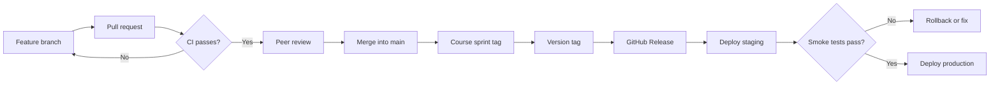

# Git and GitHub Guidelines

How the team names branches, writes commits, merges pull requests, numbers
versions, and tags releases. These rules come from the workflow section of
[PROJECT_TODO.md](PROJECT_TODO.md) and from the conventions already used in the
repository's history. Items still awaiting a team or professor decision are
marked **Open**.

## Contents

- [Quick reference](#quick-reference)
- [Branches](#branches)
- [Commits](#commits)
- [Pull requests](#pull-requests)
- [Merges](#merges)
- [Versions](#versions)
- [Tags](#tags)
- [GitHub Releases](#github-releases)
- [Release flow](#release-flow)
- [What never goes into Git](#what-never-goes-into-git)
- [Fixing mistakes](#fixing-mistakes)

## Quick reference

| Thing             | Format                                   | Example                                          |
| ----------------- | ---------------------------------------- | ------------------------------------------------ |
| Branch            | `<type>/<sprintN>-<topic>`               | `feature/sprint4-points-rewards`                 |
| Commit            | `[Label] type(scope): summary`           | `[Sprint 4] feat(points): add point history API` |
| Pull request      | Same as a commit summary                 | `[Sprint 4] feat: add role-based navigation`     |
| Merge commit      | `[Sprint N] merge: summary (#PR)`        | `[Sprint 4] merge: integrate points work (#28)`  |
| Version           | `MAJOR.MINOR.PATCH`, `-dev.N` while open | `0.4.0-dev.84`, then `0.4.0`                     |
| Version tag       | `vMAJOR.MINOR.PATCH`                     | `v0.3.0`                                         |
| Course sprint tag | `sprint-NN`                              | `sprint-03`                                      |

## Branches

- Never develop directly on `main`. Every change reaches `main` through a pull
  request.
- Branch from an up-to-date `main` and keep branches short-lived.
- Name branches `<type>/<topic>`, including the sprint when the work belongs to
  one:

  | Type        | Use for                            | Example                          |
  | ----------- | ---------------------------------- | -------------------------------- |
  | `feature/`  | New stories or capabilities        | `feature/sprint4-points-rewards` |
  | `fix/`      | Bug fixes                          | `fix/sprint4-mfa-hint-alignment` |
  | `refactor/` | Restructuring without new behavior | `refactor/frontend-architecture` |
  | `docs/`     | Documentation only                 | `docs/git-guidelines`            |
  | `chore/`    | Tooling, dependencies, upkeep      | `chore/sprint4-repo-linting`     |
  | `deploy/`   | Deployment and hotfix work         | `deploy/hotfix-permission-issue` |

- Use lowercase words separated by hyphens.
- To bring in newer `main` changes, merge `main` into your branch (see
  [Merges](#merges)). Do not force-push a branch someone else is working on.
- Delete the branch on GitHub after its pull request is merged and the release
  is verified.

## Commits

### Format

```text
[Label] type(scope): short summary

- Optional bullet list of what changed and why
- Story: 26260
```

**Label**: which body of work the commit belongs to.

| Label        | Use for                                                     |
| ------------ | ----------------------------------------------------------- |
| `[Sprint N]` | Anything delivered as part of sprint N. Required on `main`. |
| `[General]`  | Cross-sprint housekeeping, such as shared docs or tooling.  |
| `[Future]`   | Planning for work not yet scheduled, such as roadmap docs.  |

**Type**: what kind of change it is.

| Type       | Use for                                                      |
| ---------- | ------------------------------------------------------------ |
| `feat`     | New user-facing behavior                                     |
| `fix`      | Bug fixes                                                    |
| `refactor` | Restructuring that does not change behavior                  |
| `style`    | Formatting only (whitespace, Prettier/Ruff output), no logic |
| `test`     | Adding or correcting tests only                              |
| `docs`     | Documentation only                                           |
| `chore`    | Tooling, dependencies, version bumps, repository upkeep      |
| `ci`       | GitHub Actions workflows                                     |
| `merge`    | Merge commits (see [Merges](#merges))                        |

**Scope** (optional): the area touched, in lowercase, such as `points`,
`drivers`, `assets`, `view-as`, `profile`, or `mfa`.

### Summary line

- Write it in the imperative: "add", "fix", "remove", not "added" or "adds".
- Start in lowercase and leave off the final period.
- Keep the whole line, label included, to about 72 characters.
- Describe the change, not the activity: `fix: keep the driver dropdown inside
the card`, not `fix: changes` or `tweak: pill location`.

### Body

- Optional for small commits; recommended for anything a reviewer should
  understand quickly.
- Use a short bullet list of what changed and why.
- Include the user-story or task ID (`Story: 26260`) here or in the pull
  request.

### Examples

```text
[Sprint 4] feat(points): add role-scoped point history API
[Sprint 4] fix: align the driver MFA hint with the setting text
[Sprint 4] refactor: move RoadTruck effects into assets
[Sprint 4] test: cover driver reject and drop permissions
[Sprint 4] chore: set frontend version to 0.4.0-dev.84
[General] docs: add Git and GitHub guidelines
```

### Habits

- Keep each commit focused enough to review and revert on its own.
- Run the relevant tests and `npm run lint` (frontend) before committing; see
  [LINTING.md](LINTING.md).
- Check the file list before committing. Leave out unrelated work and anything
  in [What never goes into Git](#what-never-goes-into-git).

## Pull requests

- Open a pull request into `main` for every change.
- Title it like a commit summary: `[Sprint 4] feat: add role-based navigation`.
- CI (`.github/workflows/ci-cd.yml`) runs on every pull request. It must pass
  before merging.
- At least one teammate approves before merging.
- The description should cover:
  - Sprint and story/task IDs
  - Summary, with screenshots for UI changes
  - Test evidence (what was run, what passed)
  - Migration impact (new migrations, data changes)
  - Security or configuration impact (new environment variables, permissions)
  - Documentation impact
  - How a reviewer can launch and check it

**Open:** a pull-request template file, branch protection on `main`, and making
CI a required check are planned but not yet set up.

## Merges

### Merging a pull request

- **Open:** whether the team uses squash merges or merge commits. Until decided,
  use a merge commit.
- Replace GitHub's default title (`Merge pull request #28 from …`) with the
  sprint convention, keeping the pull-request number:

  ```text
  [Sprint 4] merge: integrate points, driver management, and dashboards (#28)
  ```

- Put a short bullet summary of what the pull request delivered in the merge
  commit body.

### Updating a branch with `main`

- Merge `main` into the branch rather than rebasing a shared branch.
- A descriptive title is preferred over Git's default
  (`Merge remote-tracking branch 'origin/main' into …`):

  ```text
  [Sprint 4] merge: sync main into feature/sprint4-points-rewards
  ```

- Resolve conflicts, re-run tests, then push.

## Versions

The project follows [Semantic Versioning](https://semver.org/):
`MAJOR.MINOR.PATCH`.

- **Major stays `0`** while the product is in initial development. `1.0.0` is
  the final production release.
- **Each sprint release bumps the minor version**: Sprint 3 shipped as `0.3.0`,
  Sprint 4 ships as `0.4.0`.
- **A fix-only release between sprints bumps the patch**: `0.4.1`.
- **While a sprint is in progress**, the version is a pre-release of the next
  minor version: `0.4.0-dev.N`. Increase `N` whenever you like (for example,
  to the number of commits so far); it only has to go up. `0.4.0-dev.84` sorts
  before `0.4.0`.

The version lives in `frontend/package.json` (and its lockfile). Change it from
`frontend/` so both files stay in sync, and commit the result:

```powershell
npm version 0.4.0-dev.120 --no-git-tag-version
```

`--no-git-tag-version` stops npm from creating its own commit and tag.

| Release        | Version        | Date   | Highlights                                             |
| -------------- | -------------- | ------ | ------------------------------------------------------ |
| Sprint 1       | `0.1.0`        | Sep 17 | Login, sponsor link-driver, database-backed About page |
| Sprint 2       | `0.2.0`        | Sep 24 | Profile management, password reset, initial deployment |
| Sprint 3       | `0.3.0`        | Sep 30 | Admin account management, view-as, hardened MFA        |
| Sprint 4 (now) | `0.4.0-dev.84` | —      | Points, role-based navigation, dashboards, assets      |

## Tags

A tag permanently names one commit so old releases can be checked out and
demonstrated. Always use annotated tags (`-a`) on the accepted commit on `main`.

> [!CAUTION]
> Once a tag is pushed, treat it as permanent. Moving or reusing a published tag
> breaks every old demo and comparison that depends on it.

### Version tags

- One per release, matching the version: `v0.1.0`, `v0.2.0`, `v0.3.0`, …,
  `v1.0.0`.
- `v0.1.0` to `v0.3.0` were added retroactively on the last `main` commit of
  each sprint. **Open:** push them once the team agrees.

### Course sprint tags

- One per sprint on the accepted `main` commit, zero-padded so they sort:
  `sprint-01`, `sprint-02`, `sprint-03`. They normally sit on the same commit as
  that sprint's version tag.
- If the professor requires a tag for every story merge:
  `sprint-03-story-26260`, then `sprint-03-final` on the accepted commit.
- **Open:** confirm the exact per-commit/per-merge tagging rubric with the
  professor and record it here.

### Creating and pushing tags

```powershell
git switch main
git pull --ff-only origin main
git tag -a v0.4.0 -m "Sprint 4 release: points, role-based navigation, dashboards"
git tag -a sprint-04 -m "Sprint 4 accepted release"
git push origin v0.4.0 sprint-04
```

- Tags are not pushed with ordinary commits. Push each tag by name, as above.
  GitHub Desktop does not reliably push tags it did not create.
- List tags with their messages: `git tag -n1`.

### Correcting a tag before it is pushed

```powershell
git tag -d v0.2.0                      # delete the local tag
git tag -a v0.2.0 <commit> -m "..."    # recreate it on the right commit
```

Never delete or move a tag that has already been pushed.

## GitHub Releases

- Create each GitHub Release from its version tag.
- Release notes include:
  - Sprint number and included stories
  - Database migration level
  - Required environment variables
  - Known issues
  - Demo accounts and data instructions
  - Deployment URL and commit SHA

> [!WARNING]
> Tags preserve code, not database state. Old code can fail against a database
> with newer migrations. Demo an old release with a compatible database
> snapshot, fixture, or separate sprint database.

## Release flow



## What never goes into Git

- Secrets of any kind: `.env` files, keys, passwords, tokens. Deployment secrets
  belong in GitHub Actions secrets; see [DEPLOYMENT.md](DEPLOYMENT.md).
- Local databases (`db.sqlite3`), virtual environments (`venv/`), and
  `node_modules/`.
- Generated output such as `frontend/build/` and `__pycache__/`.
- Line endings are normalized by `.gitattributes`; don't fight it with editor
  settings. Git's "LF will be replaced by CRLF" warnings on Windows are expected.

## Fixing mistakes

| Situation                                 | Fix                                                        |
| ----------------------------------------- | ---------------------------------------------------------- |
| Bad message on your last, unpushed commit | `git commit --amend`                                       |
| Wrong files in an unpushed commit         | Undo the commit in GitHub Desktop, then commit again       |
| A pushed commit needs undoing             | `git revert <commit>`; never rewrite `main`'s history      |
| A deployed migration needs changing       | Add a new migration; never edit one that has been deployed |
| An unpushed tag is wrong                  | `git tag -d <tag>` and recreate it                         |
| A pushed tag is wrong                     | Leave it; agree on a follow-up tag with the team           |
