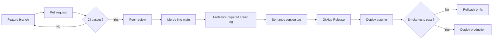

# Good Driver Incentive Program — Project TODO

> [!IMPORTANT]
> This is the shared engineering backlog for Team 11. Product stories still belong in the team's sprint-planning system; this document tracks the cross-cutting work needed to keep the project deployable, secure, understandable, and demo-ready.

## Contents

- [Good Driver Incentive Program — Project TODO](#good-driver-incentive-program--project-todo)
	- [Contents](#contents)
	- [How to use this document](#how-to-use-this-document)
	- [P0 — Team workflow and release safety](#p0--team-workflow-and-release-safety)
		- [Branching and pull requests](#branching-and-pull-requests)
		- [Commit format](#commit-format)
		- [Professor-required sprint tags](#professor-required-sprint-tags)
		- [Git releases and prior-sprint demos](#git-releases-and-prior-sprint-demos)
		- [Release flow](#release-flow)
	- [P0 — GitHub Actions, secrets, and deployment](#p0--github-actions-secrets-and-deployment)
		- [Repository and environment secrets](#repository-and-environment-secrets)
		- [Continuous integration workflow](#continuous-integration-workflow)
		- [Release workflow](#release-workflow)
		- [Deployment workflow](#deployment-workflow)
		- [Production runtime](#production-runtime)
	- [P0 — Security and production configuration](#p0--security-and-production-configuration)
	- [P1 — Database documentation and design](#p1--database-documentation-and-design)
		- [Diagrams](#diagrams)
		- [Data dictionary](#data-dictionary)
		- [Schema review and refactoring](#schema-review-and-refactoring)
	- [P1 — Input normalization and auditability](#p1--input-normalization-and-auditability)
		- [Input normalization](#input-normalization)
		- [Audit logging](#audit-logging)
	- [P1 — Application architecture](#p1--application-architecture)
		- [Frontend reorganization](#frontend-reorganization)
		- [Application logo and browser metadata](#application-logo-and-browser-metadata)
		- [Backend reorganization](#backend-reorganization)
	- [P1 — Sponsor organization management](#p1--sponsor-organization-management)
	- [P1 — Quality standards](#p1--quality-standards)
	- [P2 — Product roadmap](#p2--product-roadmap)
	- [Recommended execution order](#recommended-execution-order)
	- [Definition of done](#definition-of-done)

## How to use this document

| Priority | Meaning | Expected handling |
| --- | --- | --- |
| **P0** | Release, security, or team-process blocker | Schedule before or at the start of the next feature sprint |
| **P1** | Important engineering foundation | Assign to a sprint with an owner and acceptance criteria |
| **P2** | Planned product capability | Convert into user stories before implementation |

Every checked item should have evidence when applicable: a pull request, test, diagram, release, deployment log, or documentation link.

---

## P0 — Team workflow and release safety

### Branching and pull requests

- [ ] Protect `main` from direct feature development.
- [ ] Require pull requests before changes enter `main`.
- [ ] Require at least one teammate approval.
- [ ] Require passing CI checks before merging.
- [ ] Prefer short-lived branches using these names:
  - `feature/<story-or-feature>`
  - `fix/<bug>`
  - `docs/<topic>`
  - `refactor/<area>`
  - `chore/<maintenance-task>`
- [ ] Decide whether the team will use squash merges consistently.
- [ ] Delete merged remote branches after the release is verified.
- [ ] Add a pull-request template containing:
  - Sprint and story/task IDs
  - Summary and screenshots
  - Test evidence
  - Migration impact
  - Security/configuration impact
  - Documentation impact
  - Reviewer launch instructions

### Commit format

All commits that will reach `main` should identify their sprint and use a conventional type.

```text
[Sprint 3] feat: add sponsor organization management
[Sprint 3] fix: prevent duplicate organization names
[Sprint 3] test: cover organization access controls
[Sprint 3] docs: add organization data dictionary
```

- [ ] Require `[Sprint N]` in every commit merged to `main`.
- [ ] Use one of the agreed prefixes: `feat`, `fix`, `test`, `docs`, `refactor`, `chore`, or `ci`.
- [ ] Include the user-story/task ID in the commit body or pull request.
- [ ] Keep commits focused enough to review and revert independently.
- [ ] Do not include secrets, generated builds, local databases, virtual environments, or `.env` files.

### Professor-required sprint tags

> [!CAUTION]
> A Git tag identifies a particular commit. Moving or silently replacing a published sprint tag destroys the reliability of old demos. Published tags must be treated as immutable.

- [ ] Add an annotated sprint tag to the accepted `main` commit for every sprint.
- [ ] Use zero-padded tag names so they sort correctly:
  - `sprint-01`
  - `sprint-02`
  - `sprint-03`
- [ ] If the professor requires every merge commit to be tagged, use:
  - `sprint-03-story-26260`
  - `sprint-03-story-26261`
  - `sprint-03-final`
- [ ] Confirm the exact per-commit/per-merge tagging rubric with the professor and record it here.
- [ ] Never reuse a sprint tag after it has been pushed.
- [ ] Push annotated tags to GitHub.

Example final-sprint tagging commands:

```powershell
git switch main
git pull --ff-only origin main
git tag -a sprint-03 -m "Sprint 3 accepted release"
git push origin sprint-03
```

Example story-merge tag when required:

```powershell
git tag -a sprint-03-story-26260 -m "Sprint 3: self-profile management"
git push origin sprint-03-story-26260
```

### Git releases and prior-sprint demos

- [ ] Create a semantic version tag for each deployable release:
  - `v0.1.0`
  - `v0.2.0`
  - `v0.3.0`
  - `v1.0.0` for the final production release
- [ ] Create each GitHub Release from its version tag.
- [ ] Attach or link release notes containing:
  - Sprint number
  - Included stories
  - Database migration level
  - Required environment variables
  - Known issues
  - Demo accounts/data instructions
  - Deployment URL and commit SHA
- [ ] Create a deterministic demo-data fixture or seed command for each sprint.
- [ ] Document how to check out and launch every tagged sprint.
- [ ] Decide whether old versions will be redeployed on demand or kept in separate demo environments.
- [ ] Use a separate demo database or compatible fixture for old releases.
- [ ] Verify a previous sprint can be restored before presenting the current sprint.

> [!WARNING]
> Git tags preserve code, not database state. Old code may fail against a database that has newer migrations. A back-demo plan therefore requires a compatible database snapshot, fixture, or isolated sprint database.

### Release flow



---

## P0 — GitHub Actions, secrets, and deployment

### Repository and environment secrets

- [ ] Store deployment credentials in **GitHub Actions secrets**, never in source files.
- [ ] Use GitHub **environment secrets** for values that differ between `staging` and `production`.
- [ ] Require approval before a production environment deployment.
- [ ] Use the narrowest credentials possible; the app must not use the shared RDS administrator account.
- [ ] Prefer short-lived AWS credentials through GitHub OpenID Connect instead of long-lived AWS access keys.
- [ ] Mask secrets and never print them in workflow logs.
- [ ] Document each secret's owner and rotation process without documenting its value.

Proposed secrets and variables:

| Name | Type | Purpose |
| --- | --- | --- |
| `DJANGO_SECRET_KEY` | Environment secret | Django cryptographic signing |
| `DB_NAME` | Environment variable or secret | Application database name |
| `DB_USER` | Environment secret | Restricted application DB user |
| `DB_PASSWORD` | Environment secret | Application DB password |
| `DB_HOST` | Environment variable or secret | RDS hostname |
| `DB_PORT` | Environment variable | MySQL port, normally `3306` |
| `TOTP_ENCRYPTION_KEY` | Environment secret | Encryption for stored MFA seeds |
| `REACT_APP_API_URL` | Environment variable | Frontend API origin |
| `AWS_ROLE_ARN` | Environment variable | OIDC deployment role, if adopted |
| Email/SMS provider keys | Environment secrets | Notification delivery |

> [!NOTE]
> GitHub secrets are available to Actions, but they do not automatically configure a developer's local machine or a running server. Local development still uses an ignored `.env`; deployment must pass secrets into the runtime environment.

### Continuous integration workflow

- [x] Add `.github/workflows/ci-cd.yml`.
- [x] Trigger CI for pull requests and pushes to `main`.
- [x] Install backend dependencies in a clean environment.
- [x] Run Django system checks.
- [x] Ensure no migrations are missing:

  ```powershell
  python manage.py makemigrations --check --dry-run
  ```

- [x] Run backend tests against an isolated test database.
- [x] Install frontend dependencies with `npm ci`.
- [x] Run frontend tests in non-watch mode.
- [x] Produce a frontend production build.
- [ ] Add linting and formatting checks.
- [ ] Add dependency and secret scanning.
- [ ] Upload test/coverage reports when a job fails.
- [ ] Make CI a required branch-protection check.

### Release workflow

- [ ] Add `.github/workflows/release.yml`.
- [ ] Trigger it only from version tags such as `v*.*.*`.
- [ ] Verify the tagged commit is reachable from `main`.
- [ ] Re-run tests and builds against the tag.
- [ ] Generate or validate release notes.
- [ ] Create the GitHub Release from the Git tag.
- [ ] Preserve build metadata, commit SHA, and migration information.
- [ ] Do not create production releases from untagged branches.

### Deployment workflow

- [x] Integrate EC2/Docker Compose deployment into `.github/workflows/ci-cd.yml`.
- [ ] Deploy to staging first.
- [x] Use a GitHub environment for the current production deployment.
- [ ] Require manual approval before production.
- [x] Apply Django migrations with clear failure handling.
- [x] Collect static files.
- [x] Build and deploy the React frontend.
- [x] Configure the environment-specific API URL.
- [x] Run post-deployment API and SPA smoke tests.
- [ ] Record the deployed release tag and commit SHA.
- [ ] Document rollback to the previous release.
- [ ] Verify database restore procedures before relying on automated deployment.

### Production runtime

- [x] Run Django with Gunicorn behind Caddy.
- [x] Add a database-aware health-check endpoint at `/api/health/`.
- [x] Persist uploaded profile pictures in the current host's Docker named volume.
- [ ] Configure HTTPS and secure cookies.
- [ ] Configure application and deployment logs.
- [ ] Confirm RDS backups can actually be restored.
- [ ] Document server startup/shutdown behavior and quiet-hour handling.

---

## P0 — Security and production configuration

The repository now has environment-driven production hardening. The remaining
items track operational verification and separation that cannot be guaranteed by
settings code alone.

- [x] Move Django's `SECRET_KEY` to an environment variable.
- [x] Make `DEBUG` environment-controlled and default it to `False`.
- [x] Configure `ALLOWED_HOSTS` from the environment.
- [x] Configure CORS and CSRF trusted origins from the environment.
- [ ] Separate development, test, staging, and production settings.
- [x] Run Django's deployment checks in CI:

  ```powershell
  python manage.py check --deploy
  ```

- [ ] Audit Git history for credentials and private data.
- [ ] Rotate every credential that was committed or exposed.
- [ ] Confirm `.env`, SQLite files, media, logs, coverage, and build output are ignored.
- [ ] Create a restricted MySQL user for the application.
- [ ] Remove application dependence on the RDS administrator credentials.
- [ ] Define credential ownership and rotation intervals.
- [ ] Add rate limiting and account lockout rules where appropriate.
- [ ] Review session expiration, logout invalidation, cookie security, and CSRF protection.
- [ ] Ensure passwords, MFA seeds, session IDs, and tokens never appear in logs or reports.

---

## P1 — Database documentation and design

### Diagrams

- [ ] Create a system context diagram showing:
  - Drivers, sponsors, and administrators
  - React frontend
  - Django API
  - MySQL/RDS
  - Email/SMS/MFA services
  - Media storage
- [ ] Create a Level 0 data-flow diagram.
- [ ] Create detailed DFDs for:
  - Authentication and MFA
  - Account and profile management
  - Driver–sponsor assignment
  - Points transactions
  - Catalog and purchasing
  - Reports and auditing
- [x] Generate `docs/DATABASE_ERD.md` from the actual models/database.
- [x] Verify every documented relationship against current Django migrations.
- [ ] Maintain diagrams collaboratively in Lucidchart.
- [ ] Commit exported PDF or PNG versions under `docs/diagrams/`.
- [ ] Add the diagram revision date and matching release/tag.

### Data dictionary

- [ ] Create `docs/DATA_DICTIONARY.md`.
- [ ] Document every current and future application table.
- [ ] Include the following for each field:

| Attribute | Required documentation |
| --- | --- |
| Model/table | Django model and physical table name |
| Field/column | Application and database names |
| Purpose | Business meaning, not merely the code name |
| Type | Django type and database type |
| Size | Maximum length or numeric precision |
| Null/default | Nullability and default behavior |
| Keys | Primary, foreign, and unique keys |
| Constraints | Allowed values and cross-field rules |
| Normalization | Trimming, casing, formatting, and canonical form |
| Sensitivity | Public, internal, personal, credential, or secret |
| Authorization | Roles allowed to read or modify it |
| Source | User input, system generated, or imported |
| Retention | Archive/deletion expectations |
| API mapping | Serializer/API field names |
| Example | A safe, fictional example value |

Initial models to document:

- [ ] Django user and authentication tables
- [ ] `SponsorCompany`
- [ ] `SponsorAccount`
- [ ] `Driver`
- [ ] `MFASettings`
- [ ] `MFACode`
- [ ] `MFABackupCode`
- [ ] `LoginAttempt`
- [ ] `DriverNotification`
- [ ] `AdminImpersonationEvent`
- [ ] `AboutPageRelease`
- [ ] Future points, catalog, order, and audit models

### Schema review and refactoring

- [ ] Identify duplicated sources of truth.
  - Driver display name versus Django user name fields
  - Role represented through staff flags and related profiles
  - Account status versus driver approval status
- [ ] Define authoritative sources for name, email, role, account status, and organization.
- [ ] Decide whether a custom Django user model is required before more tables depend on the current model.
- [ ] Review every relationship's deletion behavior: `CASCADE`, `SET_NULL`, or `PROTECT`.
- [ ] Add indexes for frequently searched and reported fields.
- [ ] Add database constraints for impossible states.
- [ ] Review status enums and state transitions.
- [ ] Replace repeatable production SQL operations with migrations or management commands.
- [ ] Create safe data migrations for schema changes.
- [ ] Back up and test rollback before restructuring production data.

---

## P1 — Input normalization and auditability

### Input normalization

- [ ] Define canonical normalization rules before changing records.
- [ ] Normalize email addresses consistently.
- [ ] Enforce the same username rules in frontend, API, and database logic.
- [ ] Trim and collapse unnecessary whitespace in names and organization names.
- [ ] Enforce case-insensitive uniqueness where required.
- [ ] Normalize phone numbers to E.164.
- [ ] Store timestamps in UTC and localize only for display.
- [ ] Use integer/decimal values rather than floating point for points or money.
- [ ] Define canonical reason codes for point changes.
- [ ] Validate in Django even when React also validates.
- [ ] Add database constraints for critical rules.
- [ ] Make cleanup operations idempotent.
- [ ] Create a Django management command for legacy-data cleanup.
- [ ] Provide a dry-run mode.
- [ ] Report examined, changed, skipped, and rejected record counts.
- [ ] Back up the database before running a production cleanup.
- [ ] Never silently rewrite historical audit records.

### Audit logging

- [ ] Define auditable events:
  - Login success/failure
  - Account creation
  - Profile and organization changes
  - Role/status changes
  - Driver reassignment
  - Password/MFA changes
  - Point adjustments and reversals
  - Catalog changes
  - Purchases and cancellations
- [ ] Create an append-only audit event model.
- [ ] Record actor, target, action, timestamp, reason, and request/correlation ID.
- [ ] Record before/after values only where appropriate and safe.
- [ ] Define data-retention rules.
- [ ] Add admin-authorized audit search.
- [ ] Filter by date, action, user, and organization.
- [ ] Export CSV reports first.
- [ ] Add PDF reports only after report queries and data definitions stabilize.

---

## P1 — Application architecture

### Frontend reorganization

React is not traditional MVC. Organize the frontend by feature while separating routed pages, reusable UI, authentication, and API access.

```text
frontend/src/
├── api/
│   ├── index.js
│   ├── client.js
│   ├── accounts.js
│   ├── adminUsers.js
│   ├── authentication.js
│   └── drivers.js
├── app/
│   ├── AppLayout.jsx
│   ├── AppLayout.css
│   └── AppRoutes.jsx
├── auth/                     # Session and authentication context
├── components/               # Shared cross-feature UI such as RoadTruck
├── data/                     # Shared reference data
├── features/
│   ├── about/
│   ├── accounts/
│   ├── admin-users/
│   ├── authentication/
│   ├── drivers/
│   └── home/
└── utils/
```

This tree reflects the current repository. Add `hooks/`, shared style-system
directories (`/common/`, `/forms/`, `/layout/` under `components/` AND/OR a `styles/` directory), or new feature directories only when implemented code needs them (such as `sponsors/`).

- [x] Break `App.js` into routing and layout modules.
- [x] Split the legacy `config/api.js` module into a shared client and domain modules.
- [x] Place each feature page beside its tests and styles.
- [ ] Rename the legacy combined `Drivers.jsx` module into separate list and detail pages.
- [ ] Add feature entry points where they improve import readability without hiding ownership.
- [ ] Extract the shared driver/sponsor admin-account detail UI.
- [ ] Extract reusable loading, error, forbidden, empty, and not-found states.
- [ ] Extract reusable form fields and field-error components.
- [ ] Standardize buttons, cards, badges, avatars, banners, and design tokens.
- [ ] Adopt naming conventions:
  - `*Page.jsx` for routed pages
  - `*Form.jsx` for forms
  - `*Card.jsx` for reusable display components
  - `*.test.jsx` beside its implementation
- [ ] Decide between feature CSS and CSS Modules.
- [ ] Refactor one feature at a time while keeping tests green.
- [ ] Evaluate replacing Create React App only if the benefit justifies the migration risk.

### Application logo and browser metadata

- [ ] Finalize an approved Good Driver Incentive Program application logo.
- [ ] Export favicon assets at the appropriate browser sizes and formats.
- [ ] Replace the default React favicon and starter logos under `frontend/public/`.
- [ ] Update `frontend/public/index.html` with the correct favicon and application metadata.
- [ ] Update `frontend/public/manifest.json` with the correct application name, short name, theme colors, and icon paths.
- [ ] Confirm the logo displays correctly in browser tabs during local development.
- [ ] Confirm the logo displays correctly in the deployed production build.
- [ ] Test light/dark browser chrome and high-density displays where practical.
- [ ] Remove unused Create React App logo assets after verifying nothing references them.

### Backend reorganization

- [x] Split account serializers by registration, authentication, self-profile/passwords, admin management, and MFA.
- [x] Split account views by registration, authentication/password recovery, self-profile, admin management/impersonation, and MFA.
- [x] Split account URL modules by feature while preserving public route names.
- [x] Split account tests into feature-focused modules while preserving Django test discovery.
- [ ] Move multi-model business rules into service functions.
- [ ] Standardize API names and error responses.
- [ ] Add API versioning such as `/api/v1/` before external consumers depend on current paths.
- [ ] Resolve overlap between the legacy driver API and admin account-management APIs.
- [ ] Document authorization for every endpoint.
- [ ] Add pagination to potentially large lists.
- [ ] Standardize filtering and ordering.
- [ ] Generate and maintain an OpenAPI schema.

---

## P1 — Sponsor organization management

- [ ] Add an admin-only sponsor organization directory.
- [ ] Add organization detail and creation pages.
- [ ] Add organization editing.
- [ ] Decide whether organizations are deleted, archived, or deactivated.
- [ ] Prevent destructive deletion when related accounts exist.
- [ ] Display related sponsor users and drivers.
- [ ] Enforce case-insensitive unique organization names.
- [ ] Normalize organization names.
- [ ] Decide whether sponsors may edit public organization information.
- [ ] Add authorization and validation tests.
- [ ] Add audit records for organization changes.

---

## P1 — Quality standards

- [ ] Adopt the [definition of done](#definition-of-done).
- [ ] Require backend tests for authorization, validation, success, and failure paths.
- [ ] Require frontend tests for loading, success, empty, error, and forbidden states.
- [ ] Test responsive layouts at agreed breakpoints.
- [ ] Perform keyboard-only navigation checks.
- [ ] Add automated accessibility checks.
- [ ] Standardize user-facing success and error messages.
- [ ] Add formatting and linting configuration.
- [ ] Add `.editorconfig`.
- [ ] Add dependency vulnerability scanning.
- [ ] Define structured logging standards.
- [ ] Add production error monitoring if schedule permits.
- [ ] Remove obsolete starter assets and dead code.
- [ ] Do not rewrite historical migrations after they have been deployed.

---

## P2 — Product roadmap

Convert each item into user stories with acceptance criteria before development.

- [ ] Sponsor organization CRUD
- [ ] Driver application, approval, and rejection
- [ ] Required driver-rejection reasons
- [ ] Driver–sponsor assignment history
- [ ] Points ledger
  - Add points
  - Deduct points
  - Require a reason
  - Reverse transactions instead of deleting history
- [ ] Sponsor catalog management
  - Add/edit/archive products
  - Point prices
  - Availability/inventory
  - Product images
- [ ] Driver purchasing and order history
- [ ] Purchase cancellation rules
- [ ] User notifications
- [ ] Sponsor and driver reports
- [ ] Audit-log reports
- [ ] MFA recovery and reset workflows
- [ ] Secure impersonation, only if required
  - Explicit authorization
  - Visible impersonation banner
  - Time-limited session
  - Complete audit trail
  - No password or MFA bypass

---

## Recommended execution order

1. [ ] Approve the Git, commit, and sprint-tag conventions.
2. [ ] Add branch protection, pull-request templates, and CI.
3. [ ] Move production secrets/configuration out of source.
4. [ ] Establish staging and automated deployment.
5. [ ] Produce the ERD and first data-dictionary version.
6. [ ] Resolve database sources of truth before adding many more models.
7. [ ] Reorganize frontend/backend incrementally.
8. [ ] Build audit-event and normalization foundations.
9. [ ] Implement sponsor organization management.
10. [ ] Implement points, catalog, purchasing, and reporting features.

---

## Definition of done

A story is complete only when all applicable items are satisfied:

- [ ] Acceptance criteria are met.
- [ ] Code follows team naming and architecture conventions.
- [ ] Authorization is enforced by the backend.
- [ ] Input is validated by the backend.
- [ ] Automated tests cover success and failure paths.
- [ ] Frontend loading, empty, error, and forbidden states are handled.
- [ ] Keyboard and responsive behavior are checked.
- [ ] No secret or local-only file is included.
- [ ] Migrations are included and reviewed when models changed.
- [ ] Documentation, diagrams, and the data dictionary are updated when relevant.
- [ ] CI passes.
- [ ] A teammate reviewed the pull request.
- [ ] The pull request identifies the sprint and story/task IDs.
- [ ] The merge commit follows the required sprint convention.
- [ ] Required Git tags were created and pushed.
- [ ] The release can be deployed or restored using documented steps.

---

_Last reviewed: 2026-10-01_
